<div align="center">



<br/>

[](https://yorayriniwnl.vercel.app)

<br/>

[](https://yorayriniwnl.vercel.app)
[](https://linkedin.com/in/yorayriniwnl)
[](https://yorayriniwnl.vercel.app/resume.pdf)
[](mailto:yorayriniwnl@gmail.com)

</div>


<div align="center">

```txt
Some people write to be understood.
I build that way — with structure that holds,
interfaces that breathe,
and systems that don't ask to be forgiven.
```

<sub><i>I'm <b>Ayush Roy</b> — full-stack developer with a product mind and an obsession with doing things properly.<br/>
Solar simulators. AI classifiers. Real-time 3D. Knowledge systems in Rust. The standard doesn't change.</i></sub>

<br/><br/>

🟢 <b>Available now</b> · Full-time · Contract · Remote-first

</div>


<div align="center">

<sub><i>✦ selected work ✦</i></sub>

</div>

### ☀ Zenith · Solar Planning System
A complex domain made navigable. Rooftop feasibility, yield simulation, spatial queries, and reporting, unified into something a person can actually reason with.


[→ case study](https://yorayriniwnl.vercel.app/projects/zenith) · [→ repo](https://github.com/yorayriniwnl/zenith)

---

### 🤖 AI vs Real · Image Classifier
A moderation pipeline that knows what it's looking at. Synthetic or real, classified with explainability. Containerized. Production-ready. Honest about its reasoning.


[→ case study](https://yorayriniwnl.vercel.app/projects/ai-detector) · [→ repo](https://github.com/yorayriniwnl/ai-detector)

---

### 🧠 Yor-Smriti · Knowledge System
Built to remember things the way memory should. Rust for the engine, fast, persistent, unforgiving. TypeScript for the surface, quiet and precise.


[→ case study](https://yorayriniwnl.vercel.app/projects/yor-smriti) · [→ repo](https://github.com/yorayriniwnl/Yor-Smriti)

---

### 🌐 Neo Sculpt · 3D Browser Studio
Real-time sculpting and exploration, directly in the browser. The kind of experiment that only makes sense if you're genuinely in love with what WebGL can do.


[→ case study](https://yorayriniwnl.vercel.app/projects/neo-sculpt) · [→ repo](https://github.com/yorayriniwnl/neo-sculpt)


<div align="center">

<sub><i>✦ the craft ✦</i></sub>

<br/><br/>


<br/>


</div>


<div align="center">

<sub><i>✦ on record ✦</i></sub>

<br/><br/>


<br/><br/>


<br/><br/>


</div>


<div align="center">

<sub><i>The right problem. The right team. The right moment.</i></sub>

<br/><br/>

| Open to | Full-time · Contract · Remote |
|---|---|
| Timezone | IST · UTC +5:30 · flexible overlap |
| Resume | [view online](https://yorayriniwnl.vercel.app/resume) · [download pdf](https://yorayriniwnl.vercel.app/resume.pdf) |
| Write me | [yorayriniwnl@gmail.com](mailto:yorayriniwnl@gmail.com) · [linkedin](https://linkedin.com/in/yorayriniwnl) |

</div>


